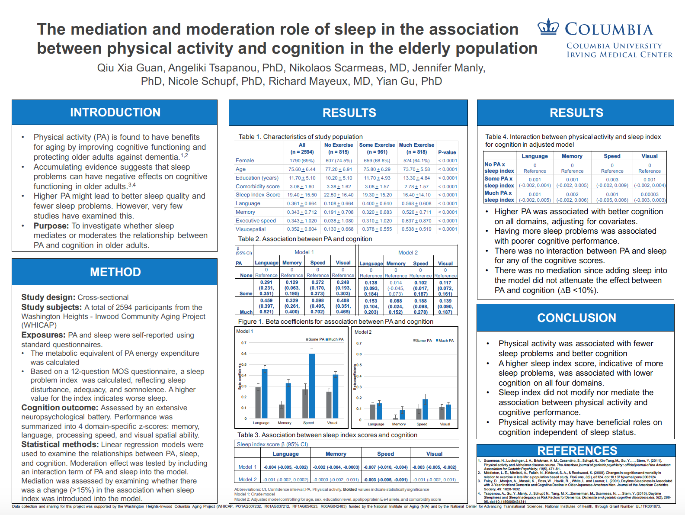
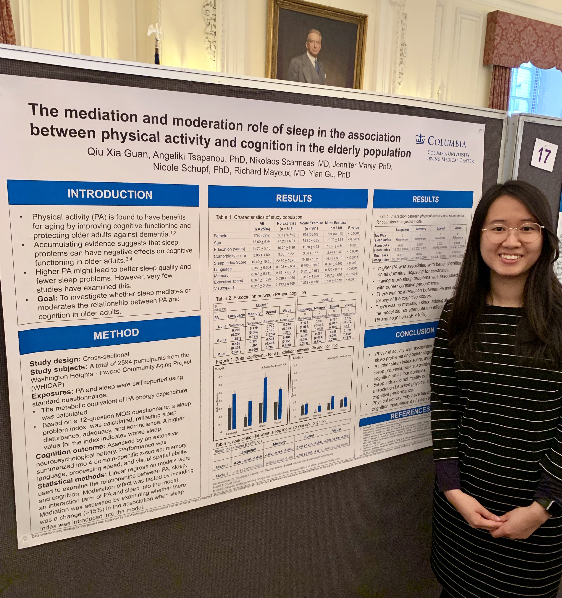
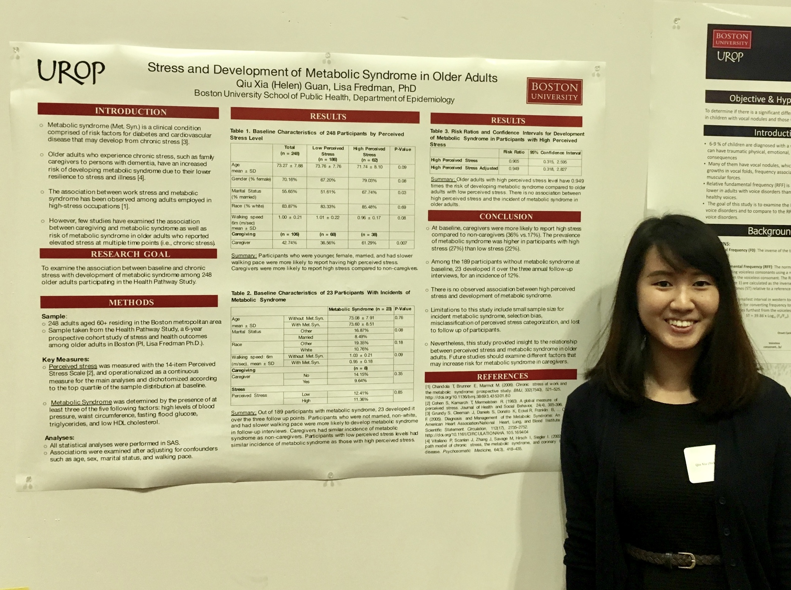

 

### Thesis Project

**Mediation and moderation role of sleep in the association between physical activity and cognition in the elderly population**  
 
This is a project that I worked on for my Master's Thesis at Columbia University. Physical activity and good sleep quality have both been found to improve cognitive functioning in older adults. The purpose of this project was to assess if sleep is a mediator (higher levels of physical activity leads to better sleep and therefore better cognition) or effect modifier (those with more physical activity and better sleep will have better cognition) in the relationship between physical activity and cognition.  
  
I presented this research project at the *6th Annual New York City Epidemiology Forum*.  
  
  
 

 
 

### Practicum Project  

**Helicobacter pylori and Gastric Cancer in High Risk Immigrant Populations: A Systematic Literature Review**  
 
This is a project that I worked on during my summer practicum at NYU Langone with the NYU Center for the Study of Asian American Health. Immigrants from regions such as Africa, Asia, and South America have been found to have much higher risk for developing gastric cancer due to increase prevalence of *H.pylori* infection. The purpose of this systematic literature review was to gain better understanding for the subject and to assess programs and regulations that are in place to improve screening and treatment of *H.pylori* in immigrant populations.  
  
I presented this research project at the *9th Biennial Asian American, Native Hawaiian, and Pacific Islander Health Conference* and *Columbia University Mailman School of Public Health Epidemiology Master’s Student Day*.  
 
  
    
 

 
 

### Undergraduate Project  
**Stress and Development of Metabolic Syndrome in Older Adults**  
 
This is a project that I worked on during my junior and senior years at Boston University. I was awarded funding for multiple semesters from the school's Undergraduate Research Opportunities Program (UROP) to design and conduct this research project. Metabolic syndrome has been found to be highly associated with stress due to occupation and life events. The purpose of this project was to examine the association between metabolic syndrome and preceived stress in older adults since many of them are experiencing difficult life changes whether it be dealing with chronic illneses or the death of spouse.  
  
I presented this research project at the *Boston University’s 19th Annual Undergraduate Research Symposium*. 
 
  
    
 

 
 

